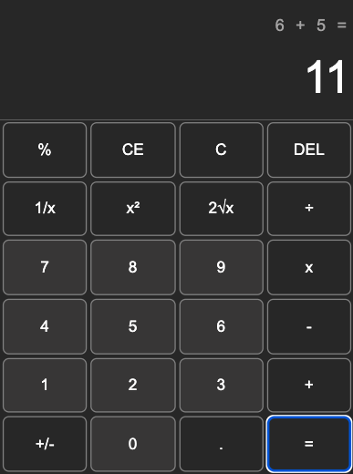

# JavaScript Calculator

This is a simple calculator built using HTML, CSS, and JavaScript. It Functions similar to Windows 10 Calculator.

This project is developed as part of [The Odin Project](https://www.theodinproject.com/) curriculum.



## To Do

- Some Operators are pending ; 1/x, 2rootx, +-
- Keyboard functioning is still pending

## Features

- Perform basic arithmetic operations: addition, subtraction, multiplication, and division.
- Calculate percentages.
- Clear the display with CE (Clear Entry) and C (Clear) buttons.
- Delete the last digit with the DEL (Delete) button.
- Display error messages for division by zero and other invalid operations.

## How to Use

1. Clone this repository to your local machine:
```
gh repo clone thedividedorange/Project-Calculator-js
```
2. Open the `index.html` file in your web browser.
3. Use the calculator by clicking on the buttons.

## Live Link

[Click here to view the live demo](https://thedividedorange.github.io/Project-Calculator-js/)

## Contributing

1. Fork this repository.
2. Create a new branch: `git checkout -b feature/new-feature`.
3. Make your changes and commit them: `git commit -m 'Add new feature'`.
4. Push to the branch: `git push origin feature/new-feature`.
5. Submit a pull request.

## Technologies Used

- HTML
- CSS
- JavaScript


